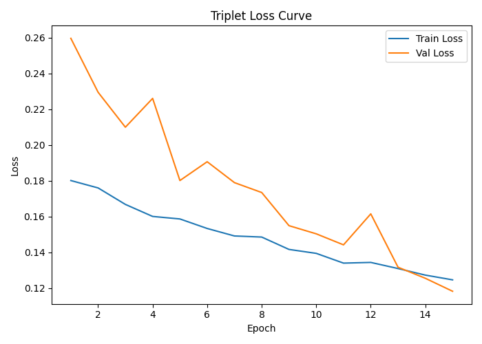
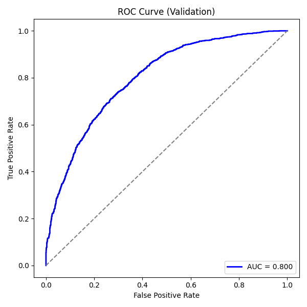
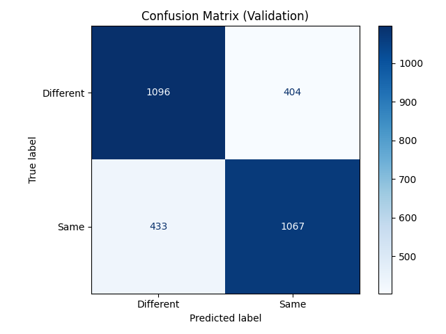

# SIIM-ISIC Melanoma Classification Challenge (Siamese network)

## Project Overview

Melanoma is responsible for 75% of deaths caused by skin cancers. The main reason for its high mortality is likely caused by late diagnosis, as early-stage melanomas are difficult to distinguish from benign lesions. To address this problem, this project develops a Siamese neural network for melanoma detection. The model is able to distinguish benign and malignant lesions more accurately. By improving diagnostic accuracy, this approach can potentially support detecting melanoma in early. Therefore, patients can be treated in time, increasing survival rates and treating with minor surgery.

## Algorithm Architecture

A Siamese network is a neural architecture designed to learn a similarity function between pairs of inputs. It learns a feature embedding space where images of the same class lie close together, while images of different classes are far apart. Each branch encodes an input image into a 512-dimensional embedding vector using a pretrained EfficientNet-B0 backbone followed by a lightweight MLP projection layer. In addition, Triplet Loss is applied to minimize distance for same-class pairs and maximize for different-class pairs


## Dataset

The dataset was generated by the International Skin Imaging Collaboration (ISIC) and images are from the following sources: Hospital Clínic de Barcelona, Medical University of Vienna, Memorial Sloan Kettering Cancer Center, Melanoma Institute Australia, University of Queensland, and the University of Athens Medical School. It contains 33,126 training images of unique benign and malignant skin lesions from over 2,000 patients. The original datset is almost 50GB. Therefore, another resized dataset on Kaggle is applied to this project.

The resized dataset can be downloaded here: https://www.kaggle.com/datasets/nischaydnk/isic-2020-jpg-224x224-resized


## Preprocessing & Training

### Data splitting

75% training, 15% validation, 10% testing

### Data Augmentation

- Resize to 224*224
- Random horizontal flips 
- random rotations (±10°)

### Hyperparameters

- Seed: 42
- Epoch: 15
- Batch Size: 4
- Optimizer: AdamW
- learning rate: 3*10e-4
- weight decay: 10e-5
- margin(Triplet loss): 0.2

Triplets (anchor, positive, negative) are generated in each epoch. This ensures the network has balanced distribution of benign and malignant samples during training, which is useful for this imbalanced dataset. After training, the best model will be save as best_model_b0_triplet.pth for testing set. The model was trained on an NVIDIA A100 GPU

## Validation & Testing

During validation, cosine similarities were computed between the anchor–positive and anchor–negative pairs, and the optimal similarity threshold was selected by the Youden index.
Next, test accuracy and test AUC are calculated for evaluation. Additionally, ROC curve and confusion matrix plot are created.

## Results & Visualisations

### Training

The best model (epoch 15): TrainLoss: 0.1246 | ValLoss: 0.1183 | Validation AUC: 0.800 | Validation Accuracy: 0.721

### Testing

Test Accuracy: 0.732
Test AUC: 0.810

The Accuracy and AUC shows that the model can differentiate benign and malignant lesions effectively, suggesting it achieved a reliable performance in this task.

### plot

#### Training Loss Curve


The loss consistently decreases for both training and validation set.

#### ROC Curve (Validation Set)


The ROC curve demonstrates the model’s ability to distinguish between “Same” and “Different” lesion pairs, with an AUC of 0.800.

#### Confusion Matrix (Validation)


The Siamese network achieved a balanced performance across both classes, correctly identifying 1096 different pairs and 1067 same pairs.

## Dependencies & Installation

All dependencies required to reproduce this project are listed in `requirements.txt`.  
To install them, run the following command inside the `siamese-s4852556` directory:

```pip install -r requirements.txt```

## Example Usage

### train 

```python train.py```

### predict

```python predict.py```

### Future Work

As the validation loss continued to decrease before the traing stopped, suggesting that convergence had not yet been fully reached. More epochs could be run to reach higher test accuracy and get a more stable model. Futhermore, advanced architectures such as EfficientNet-B3 backbones can be applied to capture more complex image features and enhance overall performance.

## References

The problem information for this project is from the [SIIM-ISIC Melanoma Classification](https://www.kaggle.com/competitions/siim-isic-melanoma-classification/overview)
The dataset information for this project is from the [ISIC 2020 Challenge Dataset](https://challenge2020.isic-archive.com)

## Academic Integrity Statement

AI was used for debugging and refining the comments and this file.
